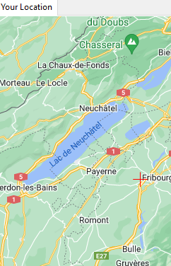

# Karten Test

| Schritt | Aktivität                               | Erwartetes Resultat                                                                                                 | Erhaltenes Resultat                                                    |
| ------- | --------------------------------------- | ------------------------------------------------------------------------------------------------------------------- | ---------------------------------------------------------------------- |
| 1       | [Programm Starten](../projekt-setup.md) | Das Programm Startet                                                                                                | Funktioniert                                                           |
| 2       | Auswahl Registerkarte "Your Location"   | 
Die Registerkarte "Verbindungs Suche" wird angezeigt. Die Aktuelle Position des Benutzers wird angezeigt.
 |                                    |
| 3       | Doppel Klicke auf die Karte             | Es werden Stationen Relativ zum Geklicktem Ort in der Stationen suche Angezeigt.                                    | Doppel Klick mitten in Bern:.png>) |
