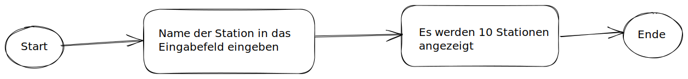

# US1: Stationen Suchen

> `Als User möchte ich nach einer Station suchen Können, um danach weiter Aktionen auszuführen.`

### Abnahmekriterien

* Wenn ein Wert in das Suchfeld eingegeben wird soll die Suche nach einer Station gestartet werden
* Es sollen mindestens 10 Stationen mit Namen welche dem Wert im Suchfeld nahe kommen angezeigt werden.

### Aktivitätsdiagramm

